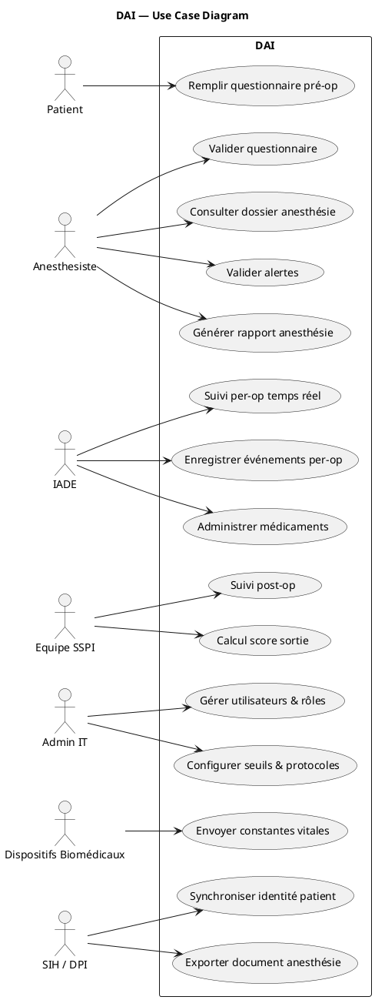
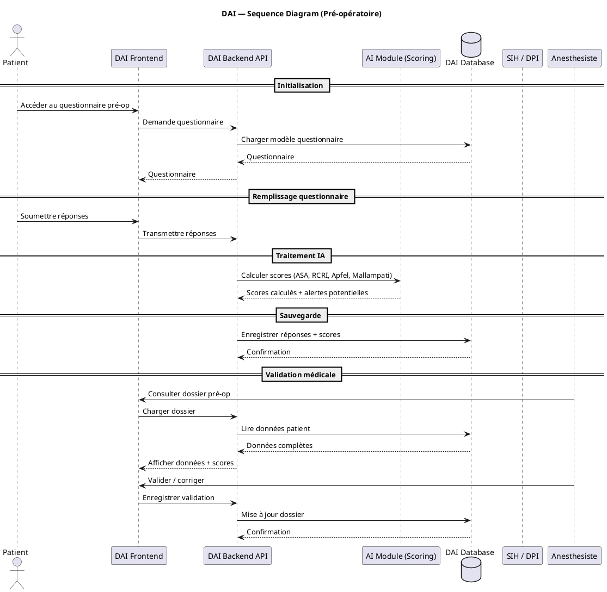
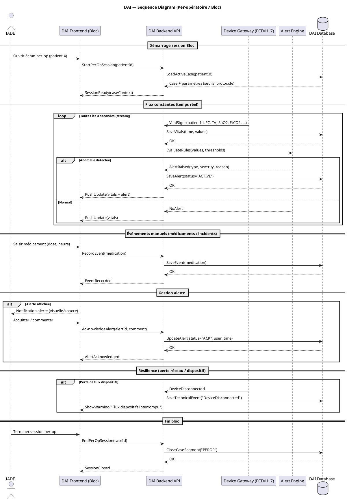
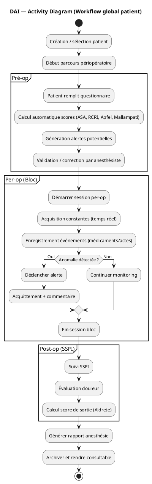
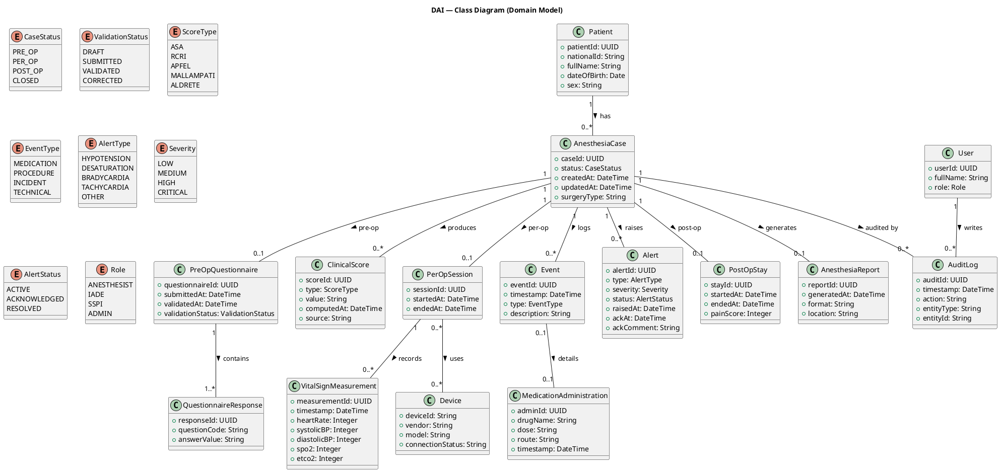

# UML Design — Phase 3 (Solutioning)

## 1) Objectif du document
Ce document “UML Design” formalise, sous forme de diagrammes UML commentés, la compréhension commune des interactions, du workflow global et du modèle métier du DAI (Dossier d’Anesthésie Intelligent).

Objectifs :
- Stabiliser les **cas d’utilisation** et les **acteurs**.
- Décrire les **flux d’exécution** majeurs (pré‑op, per‑op, parcours global).
- Définir un **modèle de classes** (domaine) cohérent avec le PRD.
- Servir de base au design détaillé (API, données) et à l’implémentation.

## 2) Position dans la méthode BMAD
- Phase BMAD : **Phase 3 — Solutioning**.
- Rôle : traduire les exigences du **PRD (Phase 2)** en représentations techniques compréhensibles par les équipes produit/tech/clinique.
- Dépendances :
  - Le PRD fixe le “quoi” (FR/NFR) ;
  - L’architecture fixe le “avec quoi” (Angular/Spring Boot/PostgreSQL, modules, sécurité, intégrations) ;
  - L’UML Design fixe le “comment” (scénarios, interactions, modèle métier), sans présumer des détails de code.

## 3) Vue d’ensemble des diagrammes
- **Use Case Diagram** : acteurs et services rendus par le DAI.
- **Sequence Diagram Pré‑op** : questionnaire → scoring → validation.
- **Sequence Diagram Per‑op** : session bloc → flux constantes → alertes → événements → clôture.
- **Activity Diagram** : workflow global patient (pré → per → post → rapport).
- **Class Diagram** : entités métier, états et relations (dossier anesthésique, mesures, alertes, audit…).

Les blocs PlantUML ci‑dessous reprennent les diagrammes historiques “tels quels” (sans changement de fond). Ils peuvent être rendus via PlantUML.

## 4) Use Case Diagram — explication
### 4.1 Intention
Le diagramme de cas d’utilisation clarifie :
- Les **acteurs humains** (Patient, Anesthésiste, IADE, Équipe SSPI, Admin IT).
- Les **acteurs systèmes** (Dispositifs biomédicaux, SIH/DPI).
- Les interactions clés attendues (pré‑op, per‑op, post‑op, admin, intégrations).

### 4.2 Diagramme (PlantUML)

### 4.3 Lecture et implications
- Les “use cases” sont alignés avec le PRD : questionnaire + scores + validation, monitoring per‑op, SSPI, documents, RBAC/paramétrage.
- Les intégrations apparaissent explicitement : alimentation en constantes (Devices) et identité/export (SIH).

## 5) Sequence Diagram Pré‑op — explication du flux
### 5.1 Intention
Ce diagramme décrit la séquence principale du **pré‑op** :
1. Accès au questionnaire.
2. Soumission des réponses.
3. Calcul des scores (module IA/scoring).
4. Persistences et consultation.
5. Validation / correction par anesthésiste.

### 5.2 Diagramme (PlantUML)

### 5.3 Points clés de conception
- **Front/Back séparés** : le Frontend ne calcule pas les scores, il orchestre l’UX.
- **Scoring** : isolé (AI Module), facilitant l’évolution (service externe ou moteur interne).
- **Traçabilité** : la validation/correction doit générer une trace d’audit (exigence PRD).
- **Données** : le stockage inclut réponses + scores (et potentiellement “alertes potentielles”).

## 6) Sequence Diagram Per‑op — explication du flux
### 6.1 Intention
Le diagramme per‑op représente :
- L’ouverture d’une session bloc.
- La boucle de réception des constantes et l’évaluation des règles.
- La création/notification et le cycle de vie des alertes.
- La saisie d’événements (médicaments/incidents).
- La résilience en cas de perte de flux.

### 6.2 Diagramme (PlantUML)

### 6.3 Points clés de conception
- **Device Gateway** : zone d’adaptation aux protocoles biomédicaux (PCD/HL7 mentionné).
- **Alert Engine** : composant explicite ; facilite l’évolution des règles.
- **Temps quasi réel** : le diagramme suppose un push (`PushUpdate`). En MVP, cela peut être réalisé via polling/SSE, puis WebSocket.
- **Résilience** : la perte de flux doit être détectable et visible côté UI.

## 7) Activity Diagram — explication du workflow global
### 7.1 Intention
Le diagramme d’activité “workflow global” décrit la **chaîne de valeur** du dossier anesthésique sur l’ensemble du parcours :
- Pré‑op : questionnaire, scores, validation.
- Per‑op : monitoring, événements, alertes.
- Post‑op : SSPI, douleur, Aldrete.
- Documents : rapport, archivage.

### 7.2 Diagramme (PlantUML)

### 7.3 Points clés de conception
- Le workflow global confirme la **continuité** des données (un dossier, plusieurs segments).
- Le point de sortie (“rapport + archivage”) est un livrable métier majeur (PRD FR‑18..FR‑20).

## 8) Class Diagram — explication du modèle métier
### 8.1 Intention
Le diagramme de classes propose un modèle de domaine pivot :
- Un **Patient** possède des **AnesthesiaCase** (dossiers).
- Le pré‑op s’appuie sur un **PreOpQuestionnaire** et des **QuestionnaireResponse**.
- Le per‑op s’appuie sur **PerOpSession**, **VitalSignMeasurement**, **Event** et **Alert**.
- Le post‑op s’appuie sur **PostOpStay** et un score **ALDRETE**.
- L’audit capture les actions des **User**.

### 8.2 Diagramme (PlantUML)

### 8.3 Points d’attention
- Les **statuts** (`CaseStatus`, `ValidationStatus`, `AlertStatus`) traduisent directement les exigences de transitions et de cycle de vie.
- Les mesures (constantes) sont naturellement **time-series** : volume et indexation doivent être pris en compte.
- L’entité `User.role` est mono‑rôle dans ce diagramme : si multi‑rôles requis, cela se traduit par une association dédiée (cf. architecture).

## 9) Traçabilité PRD → UML
Traçabilité “exigences → diagrammes” (niveau macro) :

| Exigence PRD | Couverture UML principale | Éléments clés |
|---|---|---|
| FR-01..FR-04 | Use Case + Activity + Class | `AnesthesiaCase`, `Patient`, transitions globales |
| FR-05..FR-09 | Use Case + Sequence Pré‑op + Class | questionnaire, scores, validation, alertes pré‑op |
| FR-10..FR-14 | Use Case + Sequence Per‑op + Activity + Class | per‑op session, vital signs, alert engine, événements, ack |
| FR-15..FR-17 | Use Case + Activity + Class | `PostOpStay`, douleur, `ClinicalScore(ALDRETE)` |
| FR-18..FR-20 | Use Case + Activity + Class | `AnesthesiaReport`, archivage/consultation |
| FR-21..FR-23 | Use Case + (architecture sécurité) | rôles/RBAC, paramétrage seuils/protocoles |

Notes :
- Les diagrammes UML décrivent le comportement et le domaine ; les détails d’API, sécurité et persistance sont consolidés dans le document d’architecture.

## 10) Préparation à l’implémentation
### 10.1 Découpage de mise en œuvre (alignement architecture)
- Implémenter les scénarios sous forme de **use cases** côté backend (couche application) :
  - Pré‑op : soumission questionnaire, recompute scores, validation.
  - Per‑op : start session, ingestion vitals, enregistrement événements, ack alerte.
  - Post‑op : observations SSPI, calcul Aldrete, génération rapport.
- Maintenir les entités du class diagram comme **noyau** (domain model), avec DTOs/API séparés.

### 10.2 Spécification API et événements
- Définir une spécification OpenAPI à partir des séquences (messages FE↔BE et GW↔BE).
- Fixer le mécanisme de “push update” per‑op (polling/SSE/WebSocket) en cohérence avec les NFR.

### 10.3 Données et audit
- Définir la stratégie d’historisation (mesures, événements) et d’audit (actions critiques) conformément aux NFR.
- Indexer les tables per‑op (temps, dossier) et prévoir des stratégies de rétention selon politique établissement.

### 10.4 Tests d’acceptation guidés par UML
- Générer des scénarios de test à partir des diagrammes de séquence (Given/When/Then).
- Vérifier : recalcul scores, transitions d’état, cycle de vie alertes (ACTIVE → ACK → RESOLVED), détection perte de flux.

---

## Annexes — sources historiques
- Les fichiers PlantUML sources proviennent du dossier historique `DAI-Project/diagrams/uml/source/`.
